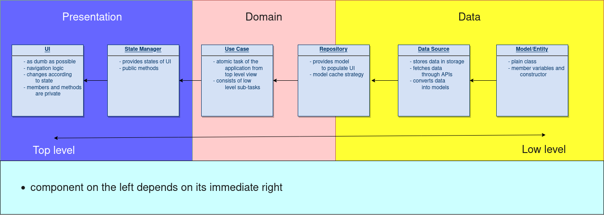

#  Clean Architecture: Flutter

## Layers of Clean Architecture in context of Flutter


## Imagine!


Imagine a scenario where you have to show some text(দ্রাক্ষাকুঞ্জ) in the UI and there are some rules attached - 

- these texts are stored in the local storage
- show a text and then delete it from local storage
- as soon as your storage is empty, you have fetch texts from a remote server
- store newly fetched texts

## Example

## UI

- renders text as soon as the text is loaded from the storage 
- shows a circular progressbar while loading the text
- shows error if any error occurs

```dart
//file: current_text_chunk_widget.dart

class CurrentTextChunkWidget extends StatelessWidget {
  const CurrentTextChunkWidget({
    Key? key,
  }) : super(key: key);

  @override
  Widget build(BuildContext context) {
    return BlocBuilder<SelectedTextCubit, SelectedTextState>(
      builder: (context, SelectedTextState state) {
        // render UI based on states
        switch (state.runtimeType) { 
          case SelectedTextLoaded:
            final text = (state as SelectedTextLoaded).textChunk.transcription;
            return Container(
                padding: EdgeInsets.all(16.0),
                decoration: BoxDecoration(
                  borderRadius: BorderRadius.circular(4.0),
                  border: Border.all(
                      width: 1, color: Theme.of(context).primaryColor),
                ),
                child: Column(
                  crossAxisAlignment: CrossAxisAlignment.start,
                  children: [
                    Text(
                      text,
                      style: GoogleFonts.raleway(fontSize: 24),
                    ),
                    SizedBox(
                      height: 8,
                    ),
                    Align(
                      alignment: Alignment.bottomRight,
                      child: IconButton(
                        onPressed: () {
                          final scaffoldMessanger =
                              ScaffoldMessenger.of(context);
                          scaffoldMessanger.showSnackBar(
                            SnackBar(
                              content: Text(StringRes
                                  .are_you_sure_you_want_to_record_against_some_other_text_data),
                              action: SnackBarAction(
                                label: StringRes.yes,
                                onPressed: () {
                                  scaffoldMessanger.hideCurrentSnackBar();
                                  //TODO
                                  //fetch new textdata
                                },
                              ),
                            ),
                          );
                        },
                        icon: Icon(
                          Icons.change_circle_outlined,
                        ),
                      ),
                    )
                  ],
                ));
          case SelectedTextError:
            return Text(StringRes.something_went_wrong);
          default:
            return CircularProgressIndicator();
        }
      },
    );
  }
}
```

## State Manager

- emits states for the UI which is listening [Observer pattern] 

```dart
//file: selecte_text_cubit.dart

class SelectedTextCubit extends Cubit<SelectedTextState> {
  SelectedTextCubit(
    this._getSelectedTextChunkUC,
    this._setCurrentTextUC,
    this._getNewTextChunkUC,
  ) : super(
          SelectedTextInitial(), // emits this state initially
        );
  final GetSelectedTextChunkUC _getSelectedTextChunkUC;

  Future<void> getSelectedTextChunk() async {
    emit(
      SelectedTextLoading(), // state
    );
    try {
      final textChunk = await _getSelectedTextChunkUC();
      emit(
        SelectedTextLoaded(textChunk), //state
      );
    } catch (e) {
      print(e);
      emit(
        SelectedTextError(), // state
      );
    }
  }

}
```

## Usecase

- top level usecase that brings a text whenk invoked

```dart
//file: get_selected_text_chunk.dart

class GetSelectedTextChunkUC {
  final TextChunkRepository _textRepository; // depends on the contract of TextChunkRepository regardless of its implementation. [Dependency Inversion Principle]

  GetSelectedTextChunkUC(this._textRepository);

  Future<TextChunk> call() => _textRepository.getCurrentTextChunk();
}
```
## Repository

 - loads texts from local storage
 - fetches texts from remote storage
 - caches newly fetched texts

```dart
//file: text_repository.dart

abstract class TextChunkRepository {
  Future<TextChunk> getCurrentTextChunk();
  Future<void> setCurrentTextChunk(TextChunk textChunk);
  Future<TextChunk> getNewTextChunk();
}

class TextRepositoryImpl implements TextChunkRepository {
  TextChunk? _currentTextChunk;
  final TextChunkLocalSource _textChunkLocalSource;
  final TextChunkApi _textChunkApi;
  final ConnectionChecker _connectionChecker;
  List<TextChunk> _textChunkList = [];

  TextRepositoryImpl(
    this._textChunkLocalSource,
    this._textChunkApi,
    this._connectionChecker,
  );
  @override
  Future<TextChunk> getCurrentTextChunk() async {
    if (_currentTextChunk == null) _currentTextChunk = await getNewTextChunk();
    return _currentTextChunk!;
  }

  Future<void> _getTexts() async {
    
    if (!await _connectionChecker.hasConnection()) throw NoInternetException();
    final fetched = await _textChunkApi.fetchTextChunk();
    // caching logic
    await _textChunkLocalSource.saveTexts(fetched);
  }

  @override
  Future<void> setCurrentTextChunk(TextChunk textChunk) async {
    _currentTextChunk = textChunk;
  }

  @override
  Future<TextChunk> getNewTextChunk() async {
    try {
      if (_currentTextChunk != null) {
        await _currentTextChunk!.delete();
        _textChunkList.remove(_currentTextChunk);
      }
    } catch (e) {}

    if (_textChunkList.isEmpty) {
      _textChunkList.addAll(await _textChunkLocalSource.getTexts());
      if (_textChunkList.isEmpty) await _getTexts();
      return getNewTextChunk();
    } else
      return _textChunkList[0];
  }
}
```

## Data Source
- local source loads texts from local disks
```dart
//file: text_chunk_local_source.dart

abstract class TextChunkLocalSource {
  Future<List<TextChunk>> getTexts();
  Future<void> saveTexts(List<TextChunk> textChunks);
}

class TextChunkLocalSourceImpl implements TextChunkLocalSource {
  final Box<TextChunk> _textChunkBox;

  TextChunkLocalSourceImpl(this._textChunkBox);
  @override
  Future<List<TextChunk>> getTexts() async {
    return _textChunkBox.values.toList();
  }

  @override
  Future<void> saveTexts(List<TextChunk> textChunks) async {
    await _textChunkBox.addAll(textChunks);
  }
}
```
- remote source connects to server and fetches text through REST API
```dart
//file: text_chunk_api.dart

abstract class TextChunkApi {
  Future<List<TextChunk>> fetchTextChunk();
}

class TextChunkApiImpl implements TextChunkApi {
  final ApiHeaderProvider _apiHeaderProvider;

  static const _transciption_endpoint = ApiConstants.base_url + '/dataset/v1/transcription/list';

  TextChunkApiImpl(this._apiHeaderProvider);
  @override
  Future<List<TextChunk>> fetchTextChunk() async {
    final headers = await _apiHeaderProvider.getGeneralHeaderMapWithAuth();
    final request = TextChunkRequest('10');
    final response = await _http.post(
      Uri.parse(_transciption_endpoint),
      body: request.toJson(),
      headers: headers,
    );
    // print(response);
    final textChunksResponseBody = utf8.decode(response.bodyBytes);
    
    if (response.statusCode == 200) {
      final list = TextChunkResponse.fromJson(textChunksResponseBody).data;
      if (list.isEmpty)
        throw ServerRanOutOfTranscriptionsException(); // TODO: catch this for future safety
      return list;
    } else {
      throw TextChunkApiException(); // throw exceptions and catch them from State manager
    }
  }
}
```

## Model
- plain class
- there are some serialization logic in it, that should not be in here, however, is not a dealbreaker
```dart
//file: text_chunk_response.dart

class TextChunkResponse {
  final List<TextChunk> data;

  TextChunkResponse(this.data);

  Map<String, dynamic> toMap() {
    return {
      'data': data.map((x) => x.toMap()).toList(),
    };
  }

  factory TextChunkResponse.fromMap(Map<String, dynamic> map) {
    return TextChunkResponse(
      List<TextChunk>.from(map['data']?.map((x) => TextChunk.fromMap(x))),
    );
  }

  String toJson() => json.encode(toMap());

  factory TextChunkResponse.fromJson(String source) => TextChunkResponse.fromMap(json.decode(source));
}
```

## Finally, what are the pros and cons of following a proper software architecture?

This one is yours to fill

---